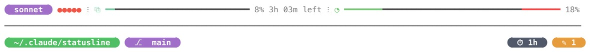
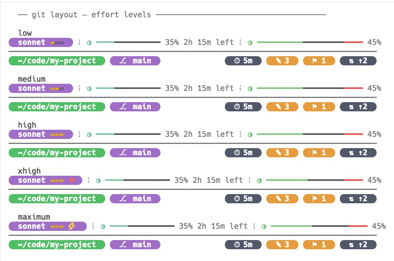
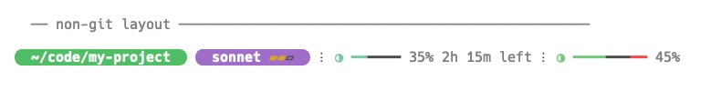
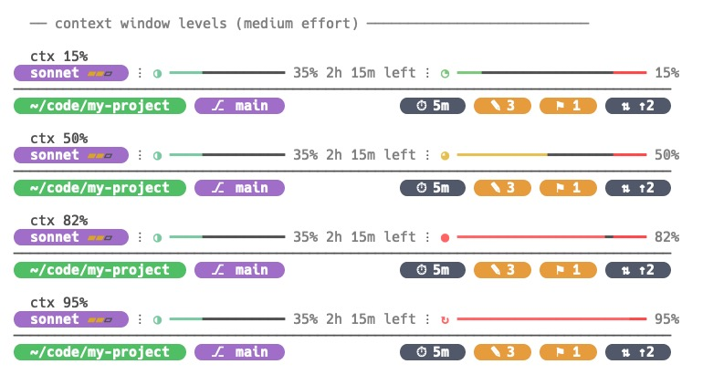
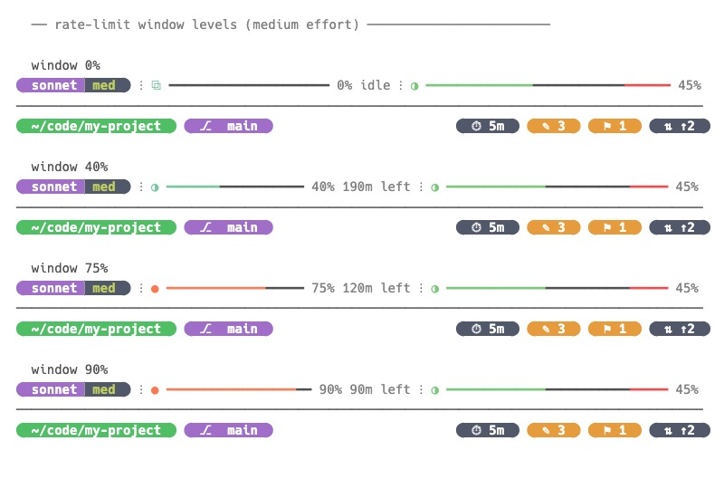

# statusline

Rich status line for [Claude Code](https://claude.ai/code), built in Go. Zero dependencies.



Displays model name, effort level, context window usage, rate-limit bar, git branch, stash count, and working directory — rendered as a compact ANSI status line on each turn.

## Requirements

- A **[Nerd Font](https://www.nerdfonts.com/)** (or any Powerline-patched font) set as your terminal font. The rounded pill caps (Powerline glyphs `U+E0B6`/`U+E0B4`) and the branch, sync, stash, and clock icons are drawn from it — without a Nerd Font they render as missing-glyph boxes.
- A terminal with **24-bit truecolor** support, used for the pill and bar colors. iTerm2, WezTerm, Kitty, Ghostty, Warp, and recent Terminal.app all qualify.
- The status line sizes itself to the terminal width Claude Code reports via `$COLUMNS` and caps on very wide windows — see [Width](#width).

## Installation

### Option A: Download binary (macOS only)

Download the latest release for macOS from [Releases](https://github.com/tiagobastos/statusline/releases) and place the binary at `~/.claude/statusline/statusline`.

```bash
mkdir -p ~/.claude/statusline

# macOS Apple Silicon
curl -L https://github.com/tiagobastos/statusline/releases/latest/download/statusline-darwin-arm64 \
  -o ~/.claude/statusline/statusline
chmod +x ~/.claude/statusline/statusline
```

For macOS Intel, use `statusline-darwin-amd64` instead.

### Option B: Build from source (macOS and Linux)

Requires Go 1.23+.

```bash
mkdir -p ~/.claude/statusline
go build -o ~/.claude/statusline/statusline github.com/tiagobastos/statusline
```

## Updating

To update to a newer release, repeat the installation step — download the new binary and replace the old one. The binary at `~/.claude/statusline/statusline` is self-contained; no other files change.

If you built from source: `go install github.com/tiagobastos/statusline@latest` then move the binary again.

## Claude Code integration

Add to `~/.claude/settings.json`:

```json
{
  "statusLine": {
    "type": "command",
    "command": "~/.claude/statusline/statusline"
  }
}
```

## Configuration

### Effort level

The effort bars reflect Claude Code's **live** reasoning-effort level for the current session — whatever `/effort` is set to, already clamped by Claude Code to what the active model supports. The status line reads this from the session payload (`effort.level`) and renders it verbatim; it does **not** read effort from `settings.json` and does not re-clamp. A model with no effort parameter (Haiku, Sonnet 4.5) shows no effort bars at all.

| Level | Display |
|---|---|
| `low` | `▰▱▱` |
| `medium` | `▰▰▱` |
| `high` | `▰▰▰` |
| `xhigh` | `▰▰▰ ✦` (red-orange sparkle) |
| `max` | `▰▰▰ ⚡` (yellow bolt) |
| _unsupported_ | _(no bars)_ |

The `/effort` slash command sets the effort for the current session.

#### What each model renders

Claude Code clamps the level you pick **down** to the highest one the active model supports, then sends that effective value — so the same `/effort` setting can render differently per model. `xhigh` exists only on Opus 4.7+ and Fable; models without an effort parameter render nothing.

| Model | `low` | `medium` | `high` | `xhigh` | `max` |
|---|---|---|---|---|---|
| Fable 5 | `▰▱▱` | `▰▰▱` | `▰▰▰` | `▰▰▰ ✦` | `▰▰▰ ⚡` |
| Opus 4.8 / 4.7 | `▰▱▱` | `▰▰▱` | `▰▰▰` | `▰▰▰ ✦` | `▰▰▰ ⚡` |
| Opus 4.6 | `▰▱▱` | `▰▰▱` | `▰▰▰` | `▰▰▰` ¹ | `▰▰▰ ⚡` |
| Sonnet 4.6 | `▰▱▱` | `▰▰▱` | `▰▰▰` | `▰▰▰` ¹ | `▰▰▰ ⚡` ² |
| Haiku 4.5 / Sonnet 4.5 | — | — | — | — | — |

¹ `xhigh` isn't supported below Opus 4.7, so Claude Code runs it as `high`.
² Sonnet 4.6 + `max` support is unconfirmed in the docs; if unsupported it clamps to `high`.

### Width

The status line sizes to the terminal width Claude Code provides via `$COLUMNS`. On a wide or maximized window it would otherwise stretch edge-to-edge, so it caps at a maximum width — **120 columns** by default — and stays left-anchored, leaving the rest of the line empty. Narrower terminals are unaffected; it uses whatever width is available.

Override the cap with `CLAUDE_STATUSLINE_MAX_WIDTH` in the `env` block of `~/.claude/settings.json` (or a project-level `.claude/settings.json`):

```json
{
  "env": {
    "CLAUDE_STATUSLINE_MAX_WIDTH": "140"
  }
}
```

Set it to `0` to disable the cap and always use the full terminal width. Long directory paths and branch names are automatically shortened with a leading `…/` to fit.

## Layout

**Git directories** — two-line layout. Model and effort bars on the first line, directory and branch info below the separator.



**Non-git directories** — single-line layout with directory and model side by side.



### Context window bar

The right bar tracks context usage. Color shifts green → yellow → red as it fills. A faint red marker near the right edge shows the auto-compact threshold.



### Rate-limit bar

The left bar tracks your 5-hour usage window. Color and icon shift as you approach the limit.



On **macOS** the OAuth token is read from the system keychain. On **Linux** it is read from `~/.claude/.credentials.json`, which Claude Code writes automatically.

## License

MIT
